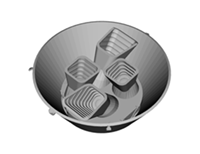
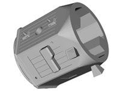
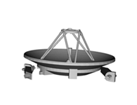

# tess-3d-printing-model
Print your own TESS Spacecraft 3D Puzzle!

## Instructions
You will need to print one of each file except for the solar arrays. You will need to print two of the arrays.

## Model files

### Cameras and sun shade

The TESS instrument is comprised of four identical cameras. Each camera has seven lenses, a package of detectors and electronics to detect transits of exoplanets around distant stars. The cameras each have a lens hood to help prevent stray light from other sources from entering lenses and distorting the light from distant stars that TESS will focus on. The four cameras are placed on a camera plate. The camera plate is enclosed by a sun shade to further protect the cameras from stay light.

### Spacecraft

The spacecraft includes the structure and components to support the TESS science instrument. Within the spacecraft, batteries, propulsion (fuel, and thrusters), reaction wheels computers for commanding the spacecraft and transmitting data all allow the TESS science instrument to complete the mission for finding ne exoplanets.

### Antennas

The antennas on TESS allow for the transmission of commands to the spacecraft and instrument. Also, the antennas allow the TESS spacecraft to transmit data collected by the TESS instrument back to Earth for analysis. The large circular dish is the High Gain Antenna; the two smaller antennas are S-Band antennas.

### Solar arrays

Spacecraft operating in the inner Solar System usually rely on the use of solar panels to derive electricity from sunlight. Solar panels on spacecraft supply power for the instrument and spacecraft systems. Solar panels need to have a lot of surface area that can be pointed towards the Sun as the spacecraft moves. More exposed surface area means more electricity can be converted from light energy from the Sun. 